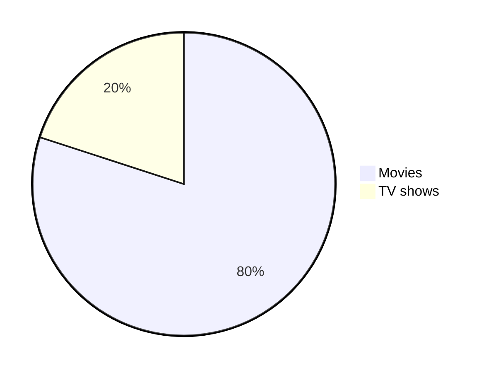
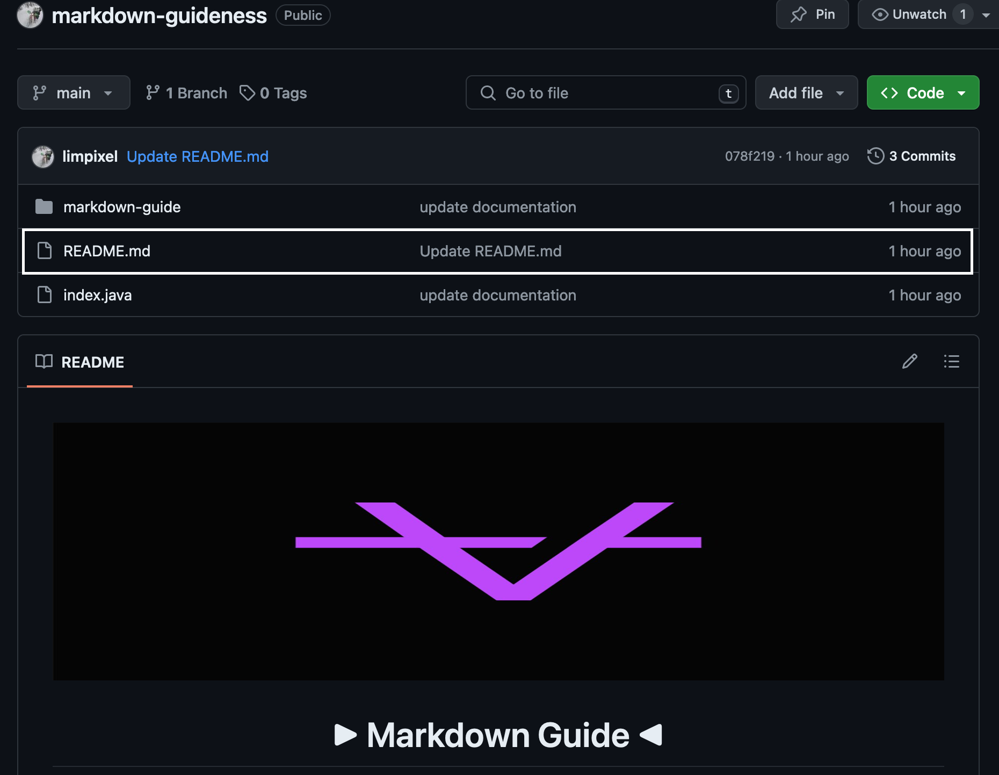

<div style="text-align: center;">
  
</div>

<a name="top"></a>

<h1 align="center">
 ▶︎ Markdown Guide  ◀︎
</h1>

<br/>

> [!IMPORTANT] Perhatian
> Dokumentasi ini dikembangakan oleh [Pemilik Profile ini](https://docs.github.com/limpixel).

## Daftar isi
- [Daftar isi](#daftar-isi)
- [Color reference :](#color-reference-)
- [Penjelasan](#penjelasan)
- [Heading](#heading)
- [Text Style](#text-style)
  - [Font Weigh](#font-weigh)
  - [Normal](#normal)
  - [Bold](#bold)
  - [Italic](#italic)
  - [Bold \& Italic](#bold--italic)
  - [Blockquotes](#blockquotes)
  - [Monospaced ( Font untuk codingan)](#monospaced--font-untuk-codingan)
  - [Underlined ( Text Di garis bawahi)](#underlined--text-di-garis-bawahi)
  - [Strike Through (Text garis)](#strike-through-text-garis)
  - [Boxed ( Ada Kotak nya rek )](#boxed--ada-kotak-nya-rek-)
  - [SubScripts](#subscripts)
  - [SuperScripts](#superscripts)
- [Aligments](#aligments)
  - [Left](#left)
  - [Center](#center)
  - [Right](#right)
- [Table](#table)
  - [Table manual](#table-manual)
  - [Table Dengan Code HTML](#table-dengan-code-html)
- [Link](#link)
  - [Inline](#inline)
  - [Reference](#reference)
  - [Footnote](#footnote)
  - [Relative](#relative)
  - [Auto](#auto)
  - [Section](#section)
  - [Hover](#hover)
- [Images](#images)
- [Images with Themes](#images-with-themes)
- [Theme](#theme)
- [Badge](#badge)
- [List](#list)
  - [Ordered](#ordered)
  - [Unordered](#unordered)
- [Task](#task)
- [Buttons](#buttons)

---
## Color reference : 
- Base : `#7E8EF1` 
- Succes : `#799351`
- Warning : `#FF7D29`
- Error : `#FC4100`


## Penjelasan

➡️ <span style="color: #7E8EF1;">Bang Markdown Apaan?</span>


Markdown adalah bahasa markup ringan yang digunakan untuk menulis teks yang mudah dibaca dan ditulis, yang dimana dikonversikan menjadi HTML secara otomatis. Ini dirancang untuk memungkinkan orang menulis dalam format teks biasa yang mudah dipahami, yang juga bisa diubah menjadi format yang terlihat bagus di web.

➡️ <span style="color:#7E8EF1;">Mengapa Menggunakan Markdown?</span>

- **Sederhana**: Mudah dipelajari dan digunakan, bahkan untuk pemula.
- **Bersih**: Membuat dokumen yang bersih dan tidak berantakan.
- **Portabel**: Didukung oleh banyak platform dan alat, seperti GitHub, Bitbucket, dan banyak editor teks.
- **Fleksibel**: Dapat digunakan untuk menulis berbagai jenis dokumen, termasuk catatan, artikel, dokumentasi, dan banyak lagi.

Contoh Penggunaan Markdown

- Penulisan Artikel dan Blog: Banyak penulis dan blogger menggunakan Markdown untuk menulis konten mereka.
- Dokumentasi Proyek: Pengembang perangkat lunak sering menggunakannya untuk membuat dokumentasi proyek.
- Catatan Pribadi: Banyak orang menggunakan Markdown untuk mencatat karena kesederhanaannya.

➡️ 🗣🔥 : <span style="color:#7E8EF1;">Mana Guidenya?</span>
<br/>

Masnya ga sabaran cik 😂 

---
## Heading
Heading ini bisa menggunakan `<h1>..</h1>` atau menggunakan `# head`, dan ini kembali ke kalian apakah mau menggunakan syntax HTML atau Markdown. Berikut contoh dan hasilnya : 

- <span style="color:#7E8EF1;" > ➡️ HTML</span> <br/>
   Code : 
   ```html 
    <h1>Heading 1</h1>
    <h2>Heading 2</h2>
    <h3>Heading 3</h3>
    <h4>Heading 4</h4>
    <h5>Heading 5</h5>
   ```
   Output : 
    <h1>Heading 1</h1>
    <h2>Heading 2</h2>
    <h3>Heading 3</h3>
    <h4>Heading 4</h4>
    <h5>Heading 5</h5>


- <span style="color:#FF7D29;" > ➡️ Markdown</span> </br>
  Code : 
  ```markdown
  # Heading 1
  ## Heading 2
  ### Heading 3
  #### Heading 4
  ##### Heading 5
  ```
  Output : 
    # Heading 1
    ## Heading 2
    ### Heading 3
    #### Heading 4
    ##### Heading 5

---
## Text Style
### Font Weigh 
### Normal 
  ```
  Hellow world 
  ```
  output : <br/>
  Hellow world
### Bold 
  ```markdown
  **Hellow world .** <br/>
  __Hellow world .__ <br/>
  <strong>Hellow world .</strong> <br/>
  ```
  > <span>Output :</span> </br>
  **Hellow world .** </br>
  __Hellow world .__ </br>
  <strong>Hellow world .</strong> </br>
  
### Italic 
  ```markdown
  *Hellow world .* </br>
  _Hellow world ._ </br>
  <em>Hellow world .</em> </br>
  ```

  > Output <br/>
  *Hellow world .* </br>
  _Hellow world ._ </br>
  <em>Hellow world .</em> </br>

### Bold & Italic 
  ```markdown
  **_Hellow world_** <br/>
  <strong><em>Hellow world</em></strong>
  ```

  > Output <br/>
  **_Hellow world_** <br/>
  <strong><em>Hellow world</em></strong>
### Blockquotes
  ```markdown
  > Hello World
  > Hello World
  >
  > Hello World
  >
  > Hello World
  > Hello World
  >> Hello World
  >>> Hello World
  > **Hello** *jumps over the lazy dog.*
  ```
  > Output : </br>
  > Hello World </br>
  > Hello World </br>
  > Hello World </br>
  > Hello World </br>
  > Hello World
  >> Hello World
  >>> Hello World
  > **Hello** *jumps over the lazy dog.*

### Monospaced ( Font untuk codingan)
  ```markdown
  <samp>The quick brown fox jumps over the lazy dog.</samp>
  ```
  > Output : <br>
  <samp>The quick brown fox jumps over the lazy dog.</samp>
### Underlined ( Text Di garis bawahi)
  ```markdown
  <ins>The quick brown fox jumps over the lazy dog.</ins>
  ```    
  > Output : <br>
  <ins>The quick brown fox jumps over the lazy dog.</ins>
### Strike Through (Text garis)
  ```markdown
  ~~The quick brown fox jumps over the lazy dog.~~
  ```
  
  > Output : <br>
  ~~The quick brown fox jumps over the lazy dog.~~
### Boxed ( Ada Kotak nya rek )
  ```markdown
  <table><tr><td>The quick brown fox jumps over the lazy dog.</td></tr></table>
  ```
  > Output : <br>
  <table><tr><td>The quick brown fox jumps over the lazy dog.</td></tr></table>
### SubScripts 
  ```markdown
  log<sub>2</sub>(x)
  Subscript <sub>The quick brown fox jumps over the lazy dog.</sub>
  ```
  > Output : <br/>
  log<sub style="color: white;">2</sub>(x) <br/>
  Subscript <sub style="color: white;">The quick brown fox jumps over the lazy dog.</sub>
### SuperScripts
  ```markdown
  2 <sup>53-1</sup> and -2 <sup>53-1</sup>
  Superscript <sup>The quick brown fox jumps over the lazy dog.</sup>
  ```

  > Output : <br>
  2 <sup style="color: orange">53-1</sup> and -2 <sup style="color: orange">53-1</sup> <br>
  Superscript <sup style="color:yellow">The quick brown fox jumps over the lazy dog.</sup>

  - ### Text Color
  | Color Name      | Code                                                                                         |Example                                                        |
  |-----------------|----------------------------------------------------------------------------------------------|----------------------------------------------------------------|
  | Apricot         | `$\color{Apricot}{The\ quick\ brown\ fox\ jumps\ over\ the\ lazy\ dog.}   $`                | $\color{Apricot}{The\ quick\ brown\ fox\ jumps\ over\ the\ lazy\ dog.}$      |
  | Aquamarine      | `$\color{Aquamarine}{The\ quick\ brown\ fox\ jumps\ over\ the\ lazy\ dog.}$`                 | $\color{Aquamarine}{The\ quick\ brown\ fox\ jumps\ over\ the\ lazy\ dog.}$   |
  | Bittersweet     | `$\color{Bittersweet}{The\ quick\ brown\ fox\ jumps\ over\ the\ lazy\ dog.}$`                | $\color{Bittersweet}{The\ quick\ brown\ fox\ jumps\ over\ the\ lazy\ dog.}$  |
  | Black           | `$\color{Black}{The\ quick\ brown\ fox\ jumps\ over\ the\ lazy\ dog.}$`                      | $\color{Black}{The\ quick\ brown\ fox\ jumps\ over\ the\ lazy\ dog.}$        |

  - ### Syntax Higlighting 
    - Code Block 
    ```
    > Output : 
    public static String monthNames[] = {"January", "February", "March", "April", "May", "June", "July", "August", "September", "October", "November", "December"};
    ```

    ````
    > Code : 
    ```
    public static String monthNames[] = {"January", "February", "March", "April", "May", "June", "July", "August", "September", "October", "November", "December"};
    ```
    ````

    ```java
    > Output : 
    public static String monthNames[] = {"January", "February", "March", "April", "May", "June", "July", "August", "September", "October", "November", "December"};
    ```

    ````
    > Code : 
    ```java
    public static String monthNames[] = {"January", "February", "March", "April", "May", "June", "July", "August", "September", "October", "November", "December"};
    ```

    ````

    Referensi di [sini](https://github.com/github-linguist/linguist/blob/master/lib/linguist/languages.yml) dan [sini](https://github.com/github-linguist/linguist/tree/master/vendor) untuk GitHub dokumentasi dalam mencari semua kata kunci yang valid.
    </br>
    
    - Diff Code block 
        ````
        > Code : 
        ```diff
        ## git diff a/test.txt b/test.txt
        diff --git a/a/test.txt b/b/test.txt
        index 309ee57..c995021 100644
        --- a/a/test.txt
        +++ b/b/test.txt
        @@ -1,8 +1,6 @@
        -The quick brown fox jumps over the lazy dog
        +The quick brown fox jumps over the lazy cat

        a
        -b
        c
        d
        -e
        f
        ```
        ````

        ```diff
        ## git diff a/test.txt b/test.txt
        diff --git a/a/test.txt b/b/test.txt
        index 309ee57..c995021 100644
        --- a/a/test.txt
        +++ b/b/test.txt
        @@ -1,8 +1,6 @@
        -The quick brown fox jumps over the lazy dog
        +The quick brown fox jumps over the lazy cat

        a
        -b
        c
        d
        -e
        f
        ```

        
    

## Aligments
### Left 
```html
<p align="left">

</p>
```
<p align="left">

</p>

### Center
```html
<p align="center">

</p>
```
<p align="center">

</p>

### Right 

```html
<p align="right">

</p>
```
<p align="right">

</p>


## Table 
### Table manual
| No  | Nama       | Usia | Kota       |
|-----|------------|------|------------|
| 1   | Andi       | 25   | Jakarta    |
| 2   | Budi       | 30   | Surabaya   |
| 3   | Citra      | 28   | Bandung    |
| 4   | Dedi       | 35   | Yogyakarta |
| 5   | Evi        | 22   | Medan      |


**⬇️ Untuk codenya sebagai berikut :**

```markdown
| No  | Nama       | Usia | Kota       |
|-----|------------|------|------------|
| 1   | Andi       | 25   | Jakarta    |
| 2   | Budi       | 30   | Surabaya   |
| 3   | Citra      | 28   | Bandung    |
| 4   | Dedi       | 35   | Yogyakarta |
| 5   | Evi        | 22   | Medan   
```

### Table Dengan Code HTML 
<table style="width:100%">
  <tr>
    <th>No</th>
    <th colspan="3">Detail</th>
  </tr>
  <tr>
    <td>1</td>
    <td>Andi</td>
    <td>Usia: 25</td>
    <td>Kota: Jakarta</td>
  </tr>
  <tr>
    <td>2</td>
    <td>Budi</td>
    <td>Usia: 30</td>
    <td>Kota: Surabaya</td>
  </tr>
  <tr>
    <td>3</td>
    <td>Citra</td>
    <td>Usia: 28</td>
    <td>Kota: Bandung</td>
  </tr>
  <tr>
    <td>4</td>
    <td>Dedi</td>
    <td>Usia: 35</td>
    <td>Kota: Yogyakarta</td>
  </tr>
  <tr>
    <td>5</td>
    <td>Evi</td>
    <td>Usia: 22</td>
    <td>Kota: Medan</td>
  </tr>
</table>

**⬇️ Untuk codenya sebagai berikut :**
```html 
<table style="width:100%">
  <tr>
    <th>No</th>
    <th colspan="3">Detail</th>
  </tr>
  <tr>
    <td>1</td>
    <td>Andi</td>
    <td>Usia: 25</td>
    <td>Kota: Jakarta</td>
  </tr>
  <tr>
    <td>2</td>
    <td>Budi</td>
    <td>Usia: 30</td>
    <td>Kota: Surabaya</td>
  </tr>
  <tr>
    <td>3</td>
    <td>Citra</td>
    <td>Usia: 28</td>
    <td>Kota: Bandung</td>
  </tr>
  <tr>
    <td>4</td>
    <td>Dedi</td>
    <td>Usia: 35</td>
    <td>Kota: Yogyakarta</td>
  </tr>
  <tr>
    <td>5</td>
    <td>Evi</td>
    <td>Usia: 22</td>
    <td>Kota: Medan</td>
  </tr>
</table>
```

Another Example : 
<table>
<tr>
<th>Before Hoisting</th>
<th>After Hoisting</th>
</tr>
<tr>
<td>
<pre lang="js">
console.log(fullName); // undefined
fullName = "Dariana Trahan";
console.log(fullName); // Dariana Trahan
var fullName;
</pre>
</td>
<td>
<pre lang="js">
var fullName;
console.log(fullName); // undefined
fullName = "Dariana Trahan";
console.log(fullName); // Dariana Trahan
</pre>
</td>
</tr>
</table>

```markdown
<table>
<tr>
<th>Before Hoisting</th>
<th>After Hoisting</th>
</tr>
<tr>
<td>
<pre lang="js">
console.log(fullName); // undefined
fullName = "Dariana Trahan";
console.log(fullName); // Dariana Trahan
var fullName;
</pre>
</td>
<td>
<pre lang="js">
var fullName;
console.log(fullName); // undefined
fullName = "Dariana Trahan";
console.log(fullName); // Dariana Trahan
</pre>
</td>
</tr>
</table>
```


## Link
### Inline
  ```
  [Github Guideness ada di sini](https://github.com/limpixel/markdown-guideness.git)
  ```
  [Github Guideness ada di sini](https://github.com/limpixel/markdown-guideness.git)
### Reference 
  ```markdown
  [Github Guideness ada di sini][reference text]

  [Github Guideness ada di sini][1]

  [Github_guide_link]

  [reference text]: https://github.com/limpixel/markdown-guideness.git
  [1]: https://github.com/limpixel/markdown-guideness.git
  [Github_guide_link]: https://github.com/limpixel/markdown-guideness.git
  ```
  [Github Guideness ada di sini][reference text]

  [Github Guideness ada di sini][1]

  [Github_guide_link]

  [reference text]: https://github.com/limpixel/markdown-guideness.git
  [1]: https://github.com/limpixel/markdown-guideness.git
  [Github_guide_link]: https://github.com/limpixel/markdown-guideness.git

### Footnote 
```markdown 
Footnote.[^1]

Some other important footnote.[^2]

[^1]: This is footnote number one.
[^2]: Here is the second footnote.
```
Footnote.[^1]

Some other important footnote.[^2]

> <span style="color:orange;">Output akan muncul di paling bawah:</span> </br>
 
<br/>

> 🗣 : Lah kenapa muncul nya di bawah? </br>

Namaya juga footnote, yang artinya catatan kaki yang artinya '**catatan yang ada di bawah**'

<!-- Ini Footer Reference nya  -->
[^1]: This is footnote number one.
[^2]: Here is the second footnote.

### Relative
> Link relative akan mengarahkan ke local file kalian dan untuk code sekaligus outputnya ada sebagai berikut : 
```markdown 
[Contoh dari Relative link](rl.md)
```
> Link sebagai berikut : [Klik di sini](relative-link.md)
### Auto 
```markdown
Visit https://github.com/
```
Visit https://github.com/ => setiap ada link seperti ini akan langsung di convert menjadi link

### Section 


akan muncul seperti ini
### Hover 
Link website [BinaryTree](https://binarytree.dev/ "Array of Developer Productivity Tools Designed to Help You Save Time") to create markdown tables.

Link website more detail [BinaryTree](## "Array of Developer Productivity Tools Designed to Help You Save Time") to create markdown tables.

## Images
```markdown

```


```markdown
![alt text][image]

[image]: https://images.unsplash.com/photo-1415604934674-561df9abf539?ixlib=rb-1.2.1&ixid=eyJhcHBfaWQiOjEyMDd9&auto=format&fit=crop&w=100&q=80
```

![alt text][image]

[image]: https://images.unsplash.com/photo-1415604934674-561df9abf539?ixlib=rb-1.2.1&ixid=eyJhcHBfaWQiOjEyMDd9&auto=format&fit=crop&w=100&q=80

```markdown

```


```md

```


```md

```

## Images with Themes
## Theme

The HTML `<picture>` element, along with the `prefers-color-scheme` media feature, enables you to dynamically adjust images according to the user's color scheme preference, providing options for both light and dark modes.

For example, the code snippet below demonstrates how to display a dark-themed BinaryTree logo when the user's device is set to a dark mode, and a light-themed BinaryTree logo for light mode settings:

```markdown
<picture>
  <source media="(prefers-color-scheme: dark)" srcset="https://github.com/lifeparticle/lifeparticle/blob/master/gh_social_dark.png">
  <source media="(prefers-color-scheme: light)" srcset="https://github.com/lifeparticle/lifeparticle/blob/master/gh_social_light.png">
  
</picture>
```


<picture>
  <source media="(prefers-color-scheme: dark)" srcset="https://github.com/lifeparticle/lifeparticle/blob/master/gh_social_dark.png">
  <source media="(prefers-color-scheme: light)" srcset="https://github.com/lifeparticle/lifeparticle/blob/master/gh_social_light.png">
  
</picture>


## Badge 

```markdown

```


# Lists 

## Ordered

```markdown
1. One
2. Two
3. Three
```

1. One
2. Two
3. Three

```markdown
1. First level
    1. Second level
        - Third level
            - Fourth level
2. First level
    1. Second level
3. First level
    1. Second level
```


1. First level
    1. Second level
        - Third level
            - Fourth level
2. First level
    1. Second level
3. First level
    1. Second level

## Unordered

```markdown
* 1
* 2
* 3

+ 1
+ 2
+ 3


- 1
- 2
- 3
```

* 1
* 2
* 3

+ 1
+ 2
+ 3


- 1
- 2
- 3


```markdown
- First level
    - Second level
        - Third level
            - Fourth level
- First level
    - Second level
- First level
    - Second level
```

- First level
    - Second level
        - Third level
            - Fourth level
- First level
    - Second level
- First level
    - Second level

```markdown
<ul>
<li>First item</li>
<li>Second item</li>
<li>Third item</li>
<li>Fourth item</li>
</ul>
```

<ul>
<li>First item</li>
<li>Second item</li>
<li>Third item</li>
<li>Fourth item</li>
</ul>


## Task

```markdown
- [x] Fix Bug 223
- [ ] Add Feature 33
- [ ] Add unit tests
```

- [x] Fix Bug 223
- [ ] Add Feature 33
- [ ] Add unit tests

## Buttons 
```markdown
<kbd>cmd + shift + p</kbd>
```

<kbd>cmd + shift + p</kbd>

```markdown
<kbd> <br> cmd + shift + p <br> </kbd>
```

<kbd> <br> cmd + shift + p <br> </kbd>

```markdown
<kbd>[Markdown-Cheatsheet](https://github.com/lifeparticle/Markdown-Cheatsheet)</kbd>
```

<kbd>[Markdown-Cheatsheet](https://github.com/lifeparticle/Markdown-Cheatsheet)</kbd>

```markdown
[<kbd>Markdown-Cheatsheet</kbd>](https://github.com/lifeparticle/Markdown-Cheatsheet)
```

[<kbd>Markdown-Cheatsheet</kbd>](https://github.com/lifeparticle/Markdown-Cheatsheet)
### Normal Button 
```markdown
<kbd>cmd + shift + p</kbd>
```

<kbd>cmd + shift + p</kbd>

```markdown
<kbd> <br> cmd + shift + p <br> </kbd>
```

<kbd> <br> cmd + shift + p <br> </kbd>

```markdown
<kbd>[Markdown-Cheatsheet](https://github.com/lifeparticle/Markdown-Cheatsheet)</kbd>
```

<kbd>[Markdown-Cheatsheet](https://github.com/lifeparticle/Markdown-Cheatsheet)</kbd>

```markdown
[<kbd>Markdown-Cheatsheet</kbd>](https://github.com/lifeparticle/Markdown-Cheatsheet)
```

### Emoji inline Button

<kbd> <br> [Markdown-Cheatsheet](https://github.com/lifeparticle/Markdown-Cheatsheet) ↗️ <br> </kbd>

```markdown
<kbd> <br> [Markdown-Cheatsheet](https://github.com/lifeparticle/Markdown-Cheatsheet) <br> </kbd>
```

## Collapse Item 
```markdown
<details>
  <summary>Markdown</summary>

-  <kbd>[Markdown Editor](https://binarytree.dev/me)</kbd>
-  <kbd>[Table Of Content](https://binarytree.dev/toc)</kbd>
-  <kbd>[Markdown Table Generator](https://binarytree.dev/md_table_generator)</kbd>

</details>
```

<details>
  <summary>Markdown</summary>

-  <kbd>[Markdown Editor](https://binarytree.dev/me)</kbd>
-  <kbd>[Table Of Content](https://binarytree.dev/toc)</kbd>
-  <kbd>[Markdown Table Generator](https://binarytree.dev/md_table_generator)</kbd>

</details>

## Horizontal Rule

```markdown
---
***
___
```
<p>OUtput </p>

---

***

___


## Diagram 

```markdown
pie
"Movies" : 80
"TV shows" : 20
```





## Alert 

```markdown
> [!NOTE]
> Essential details that users should not overlook, even when browsing quickly.

> [!TIP]
> Additional advice to aid users in achieving better outcomes.

> [!IMPORTANT]
> Vital information required for users to attain success.

> [!WARNING]
> Urgent content that requires immediate user focus due to possible risks.

> [!CAUTION]
> Possible negative outcomes resulting from an action.
```

> [!NOTE]
> Essential details that users should not overlook, even when browsing quickly.

> [!TIP]
> Additional advice to aid users in achieving better outcomes.

> [!IMPORTANT]
> Vital information required for users to attain success.

> [!WARNING]
> Urgent content that requires immediate user focus due to possible risks.

> [!CAUTION]
> Possible negative outcomes resulting from an action.

## Colors Model 


```

`#ffffff`
`#000000`

```

[Contoh ada di sini](https://github.com/lifeparticle/Markdown-Cheatsheet/issues/1)

## Memunculkan markdown di depan repository
> [!NOTE]
> Pastikan kalian membuat folder dengan format `README.md` seperti ini : 




## Emojies 
```markdown
:octocat:
```

:octocat: </br>

[Untuk emoji lengkap nya ada di sini : ](https://gist.github.com/rxaviers/7360908)

## Linebreak
You can use `<br>` to insert a single line break. Make sure to use an em space ` `. For example:

```markdown
<table><tr><td> <br> The quick brown fox jumps over the lazy dog. <br> </td></tr></table>
```

<table><tr><td> <br> The quick brown fox jumps over the lazy dog. <br> </td></tr></table>

Or

```markdown
<table><tr><td> <br><br><br> The quick brown fox jumps over the lazy dog. <br><br><br> </td></tr></table>
```

<table><tr><td> <br><br><br> The quick brown fox jumps over the lazy dog. <br><br><br> </td></tr></table>

## Back to top

First place the following code at start of your markdown file

```markdown
<a name="top"></a>
```

Then use one of the following code at the place you want to return to top.

[Back to top](#top)

[:arrow_up:](#top)

```markdown
[Back to top](#top)

[:arrow_up:](#top)
```

<table><tr><td> <br><br><br> COPYRIGHT © Abdul Halim Develop - 2024 <br><br><br> </td></tr></table>